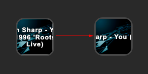
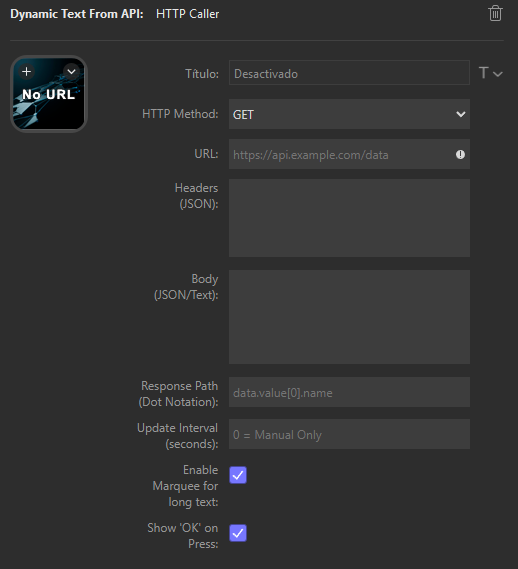

**Leer en otros idiomas:** [English](README.md)

# DynamicTextFromAPI - Stream Deck Plugin

**Autor:** Andriuker
**Versión:** 0.9.0

Un plugin para Elgato Stream Deck que te permite configurar y ejecutar peticiones HTTP (GET, POST, PUT, DELETE, PATCH) y mostrar datos dinámicos extraídos de la respuesta JSON directamente en el título de un botón.



## Características Principales

* **Peticiones HTTP Flexibles:** Realiza llamadas a APIs usando los métodos GET, POST, PUT, DELETE y PATCH.
* **Configuración Completa:** Define la URL del endpoint, los Headers (en formato JSON) y el Body (JSON o texto plano) de tu petición.
* **Extracción de Datos:** Usa "dot notation" (ej: `data.usuario.nombre`, `items[0].valor`) para extraer fácilmente el dato específico que necesitas de la respuesta JSON.
* **Título Dinámico:** Muestra el dato extraído directamente como título del botón del Stream Deck.
* **Actualización Automática:** Configura un intervalo (en segundos) para que la petición se repita automáticamente y el título se mantenga actualizado. `0` para ejecución manual únicamente.
* **Efecto Marquee (Scroll):** Si el texto extraído es muy largo, activa la opción "Marquee" para mostrarlo con una animación de desplazamiento horizontal.
* **Feedback Visual (Opcional):** Habilita o deshabilita un checkmark verde (`✓`) temporal al presionar el botón manualmente.
* **Word Wrap (Experimental):** Intenta dividir títulos largos en múltiples líneas (insertando `\n`) cuando el efecto Marquee está desactivado. *Nota: La efectividad depende del renderizado de Stream Deck.*
* **Copiar al Portapapeles:** Mantén presionado el botón (~750ms) para copiar el texto actual del título directamente a tu portapapeles.

## Instalación

1.  Descarga la última versión del plugin desde la sección de [**Releases**](https://github.com/Andriuker/DynamicTextFromAPI/releases). Necesitarás el archivo con extensión `.streamDeckPlugin`.
2.  Haz doble clic sobre el archivo descargado (`com.andriuker.dynamictextfromapi.streamDeckPlugin`).
3.  El software de Stream Deck te preguntará si deseas instalar el plugin. Confirma la instalación.

## Uso y Configuración

Una vez instalado, encontrarás una nueva acción llamada **"HTTP Caller"** en la lista de acciones del software Stream Deck, dentro de la categoría **"Dynamic Text From API"**.

1.  Arrastra la acción "HTTP Caller" a un botón vacío en tu Stream Deck.
2.  Selecciona el botón para ver el Panel de Propiedades (Property Inspector) y configura la petición:

    

    * **HTTP Method:** Selecciona el método HTTP para tu petición (GET, POST, PUT, DELETE, PATCH).
    * **URL:** Introduce la URL completa del endpoint de la API a la que quieres llamar. Asegúrate de que sea válida.
    * **Headers (JSON):** Introduce las cabeceras HTTP necesarias en formato JSON válido. Cada clave-valor representa una cabecera. Ejemplo:
        ```json
        {
          "Content-Type": "application/json",
          "Authorization": "Bearer TU_TOKEN_SECRETO",
          "X-Custom-Header": "Valor"
        }
        ```
        Si no necesitas cabeceras, déjalo vacío. Un JSON inválido mostrará "Header Err" en el botón.
    * **Body (JSON/Text):** Introduce el cuerpo de la petición, necesario para métodos como POST, PUT, PATCH.
        * Si la cabecera `Content-Type` es `application/json`, asegúrate de que el cuerpo sea un JSON válido. Un JSON inválido mostrará "Body Err".
        * Para otros `Content-Type`, el cuerpo se tratará como texto plano.
        * Déjalo vacío para GET/DELETE o si no se requiere cuerpo.
    * **Response Path (Dot Notation):** Especifica la ruta para extraer el dato deseado de la respuesta JSON. Usa la notación de puntos para objetos anidados y corchetes para arrays. Ejemplos:
        * `data.value`
        * `results[0].name.first`
        * `ip`
        * `user` (Si el valor es un objeto, se mostrará como JSON string: `{"id":1,...}`)
        Si lo dejas vacío, el plugin intentará mostrar la respuesta completa (puede resultar en `[Object]`, texto largo o el valor directo si no es un objeto).
    * **Update Interval (seconds):** El número de segundos entre cada ejecución automática de la petición. `0` deshabilita la actualización automática; la petición solo se ejecutará al presionar el botón.
    * **Enable Marquee for long text:** Marca esta casilla si quieres que los textos que excedan aproximadamente 15 caracteres se muestren con una animación de desplazamiento horizontal (marquee).
    * **Show 'OK' on Press:** Marca esta casilla para ver una confirmación visual rápida (checkmark verde `✓`) en el botón cada vez que lo presiones manualmente.

## Ejemplos Prácticos

**1. Mostrar IP Pública:**

* **Method:** `GET`
* **URL:** `https://api.ipify.org?format=json`
* **Headers:** (Vacío)
* **Body:** (Vacío)
* **Response Path:** `ip`
* **Update Interval:** `600` (Se actualiza cada 10 minutos)
* **Resultado:** El botón mostrará tu dirección IP pública actual.

**2. Obtener Título de un Post (JSONPlaceholder):**

* **Method:** `GET`
* **URL:** `https://jsonplaceholder.typicode.com/posts/1`
* **Headers:** (Vacío)
* **Body:** (Vacío)
* **Response Path:** `title`
* **Update Interval:** `0` (Solo manual)
* **Resultado:** El botón mostrará el título del post. Presiónalo para refrescar (aunque la data será la misma).

**3. Enviar un POST simple (httpbin.org):**

* **Method:** `POST`
* **URL:** `https://httpbin.org/post`
* **Headers:** `{"Content-Type": "application/json"}`
* **Body:** `{"miDato": 123, "activo": true}`
* **Response Path:** `json.miDato` (httpbin devuelve lo enviado dentro de una clave `json`)
* **Update Interval:** `0`
* **Resultado:** El botón debería mostrar `123` después de presionar.

### Copiar Título al Portapapeles

Si necesitas copiar rápidamente el valor que se muestra en el botón (por ejemplo, una IP, un ID, un nombre, etc.), simplemente **mantén presionado el botón** en tu Stream Deck durante aproximadamente 3/4 de segundo (750ms). El texto actual del título se copiará automáticamente a tu portapapeles.

## Notas y Limitaciones

* **Manejo de Errores:** El plugin muestra errores básicos en el título (`Req Error`, `Timeout`, `Net Error`, `Err [Código]`, `Header Err`, `Body Err`). Para detalles específicos, revisa los logs del plugin (habilita el modo debug en Stream Deck si es necesario).
* **Validación JSON:** Asegúrate de que el JSON introducido en Headers y Body (cuando aplique) sea estrictamente válido. Puedes usar validadores online.
* **Word Wrap (`\n`):** La función de ajuste de línea para textos largos sin marquee es experimental. Inserta `\n` basado en una estimación de caracteres (`CHARS_PER_LINE_ESTIMATE` en el código). Su apariencia final depende de cómo Stream Deck renderice estos caracteres y puede variar o no funcionar como se espera.

* **Seguridad:** Evita introducir tokens de API muy sensibles directamente en el campo Headers si el perfil de Stream Deck pudiera ser compartido. Considera las implicaciones de seguridad al manejar APIs.

## Soporte

Si encuentras algún problema, tienes sugerencias o quieres contribuir, por favor abre un [**Issue**](https://github.com/Andriuker/DynamicTextFromAPI/issues) en el repositorio de GitHub.

## Licencia

[MIT License](LICENSE.txt)

---